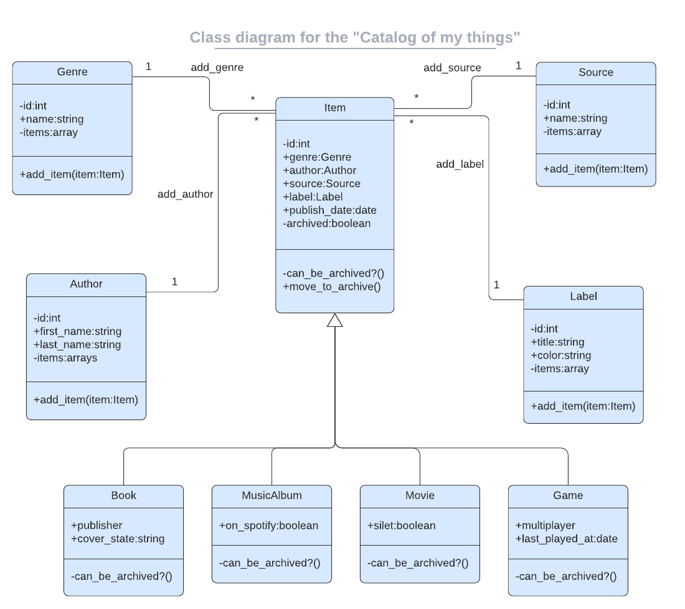

     

    
 

  <em align="center" style>" Everyday life is like programming, I guess. If you love something you can put beauty into it."</em><strong> - Sabrina Bryan</strong>
  

    

# Ruby Group Capstone : Catalog of my things

> In this project, we create a console app that will help you to keep a record of different types of things you won: books, music albums, movies, and games. Everything will be based on the UML class diagram presented below. The data will be stored in JSON files but you will also prepare a database with tables structure analogical to your program's class structure.

 
 

   <kbd>
    
    
UML class diagram of Catalog of my things project

   </kbd>

## Built With
---
 - Ruby  
 - PostgreSQL 
 
 

## Authors
---

👤 **Carlos Feliz**

- GitHub: [@xJokeer](https://github.com/xJokeer)
- LinkedIn: [@ElimFeliz](https://www.linkedin.com/in/elimfeliz/)

👤 **Rotimi Azeez**

- GitHub: [@rotimiazeez](https://github.com/rotimiazeez)
- Twitter: [@harzeyzh](https://twitter.com/Harzeyzh)
- LinkedIn: [@azeezrotimi019](https://www.linkedin.com/in/azeezrotimi019/)

👤 **Ellaouzi Hamza**

- GitHub: [hamzaoutdoors](https://github.com/Hamzaoutdoors)
- LinkedIn : [Hamza Ellaouzi](https://www.linkedin.com/in/hamza-ellaouzi-137a45b8/)
- Twitter: [Hamza Ellaouzi](https://twitter.com/EllaouziHamza)

## 🤝 Contributing

Contributions, issues, and feature requests are welcome!

Feel free to check the [issues page](https://github.com/Hamzaoutdoors/Catalog-Of-My-Things /issues).

## Show your support

Give a ⭐️ if you like this project!

## Acknowledgments

- Inspiration 💘
- Microverse program ⚡
- My standup team 😍
- My family's support 🙌
- MicroBros 😜

## 📝 License

This project is [MIT](https://github.com/Hamzaoutdoors/Catalog-Of-My-Things/blob/dev/MIT.md) licensed.

